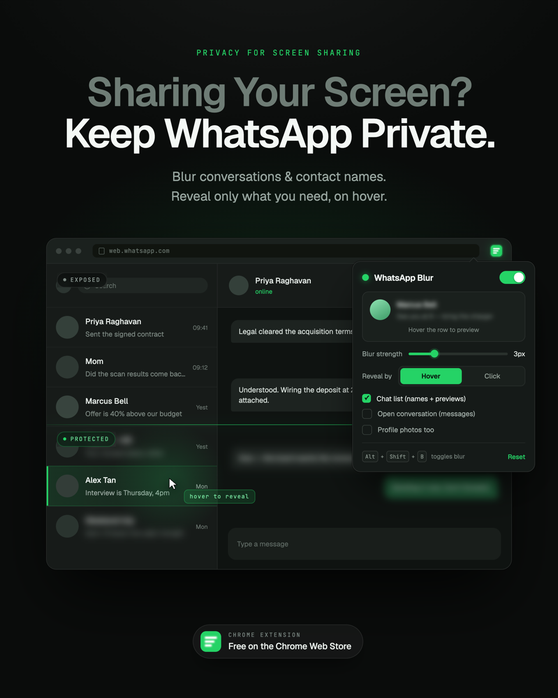

# WhatsApp Blur

<p align="center">
  
</p>

A Chrome extension that blurs contact names and messages on WhatsApp Web.
Hover a chat row and the name *and* the message come back together.

Useful when you work in public, share your screen, or just don't want the chat
list readable to whoever walks past. No build step, no dependencies, no
network code.

## Install (unpacked)

Clone the repo, then:

1. Open `chrome://extensions` in Chrome.
2. Turn on **Developer mode** (top right).
3. Click **Load unpacked** and pick this folder (the one with
   `manifest.json` in it).
4. Open <https://web.whatsapp.com> — if it was already open, reload the tab.

Pin the extension to the toolbar to get the settings popup.

## What it blurs

| Setting | Covers |
| --- | --- |
| Chat list | Contact/group names, last-message previews, timestamps, unread badges |
| Open conversation | Every message bubble (text and media) plus the header name |
| Profile photos too | Avatars in the list and header (off by default) |

Other options: blur strength (2–14px), and whether a chat reveals on **hover**
or on **click** (click mode is handy on a touchpad or when screen-sharing —
the first click reveals, the second behaves normally).

`Alt+Shift+B` toggles all blurring on and off. Rebind it at
`chrome://extensions/shortcuts`.

## How it works

- `content.js` tags the interesting nodes and does nothing else. For a chat
  row it **measures the avatar's box** — the first roughly-square element at
  least 28px across — and takes the topmost text-bearing element that clears
  it. That container holds the name, the timestamp and the preview, so one
  hover reveals them together and the profile photo stays sharp.
- `content.css` does all the visual work: `filter: blur()` on tagged nodes,
  `filter: none` when the row is hovered or revealed.
- A **fail-safe cover** blurs any chat/message row that holds no blurred
  element right now — `:not(:has(.wab-blur))`. Because `:has()` is live, the
  cover reappears in the same frame the tagged element goes away, so a row
  WhatsApp re-renders (new message, reaction, status change) is never
  readable, even for a frame.
- The blur has **no fade-in** — a fade would ramp new text from sharp to
  blurred while it played. The transition lives on the reveal rule instead,
  so revealing eases in and re-blurring snaps back.
- A `MutationObserver` (plus a 2s backstop) re-tags as WhatsApp re-renders;
  settings live in `chrome.storage.sync` and apply instantly without a reload.

Nothing depends on WhatsApp's obfuscated class names, on tag names (emoji are
`` exactly like avatars are), or on which side the avatar sits — so
right-to-left interfaces work too.

## Files

```
manifest.json    MV3 manifest (storage permission, web.whatsapp.com only)
content.js       tags chat rows, message rows, header
content.css      the blur + reveal rules
popup.html/css/js  settings UI with a live preview
background.js    Alt+Shift+B keyboard shortcut
icons/           generated PNG icons
```

## Notes

- Nothing is sent anywhere; there is no network code and no analytics.
- Blur is a visual filter — the text is still in the DOM. It hides messages
  from someone glancing at your screen, not from someone inspecting the page.
- Every failure path fails *safe*: if the avatar can't be located or the row
  can't be parsed, the whole row stays blurred rather than exposed. If you see
  a row whose photo is blurred with "Profile photos too" switched off, that is
  this fallback — tell me the kind of row and I'll extend the detection.

## Contributing

Issues and pull requests welcome. The whole thing is ~250 lines across
`content.js`, `content.css` and the popup — no build step, so editing a file
and hitting reload on `chrome://extensions` is the full dev loop.

If you hit a row that blurs wrong (a leak, or a profile photo blurred with
"Profile photos too" switched off), open an issue describing the kind of row —
group, status update, archived, a different WhatsApp language — since those
are the cases the geometry has to handle.

## License

MIT - see [LICENSE](LICENSE).

## Disclaimer

Not affiliated with, endorsed by, or connected to WhatsApp or Meta. "WhatsApp"
is a trademark of Meta Platforms, Inc., used here only to describe what this
extension works with.
